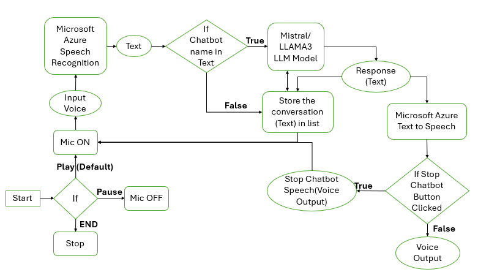

# Azones Voice Chatbot

Azones Voice Bot is a Django-based web application that provides a speech recognition interface for interacting with a Large Language Model (LLM). The application allows users to start, pause, and end conversations with the bot, as well as download conversation history in CSV format.

## Table of Contents

- [Introduction](#introduction)
- [Architecture Diagram](#architecture-diagram)
- [Features](#features)
- [Technology Stack](#technology-stack)
- [Installation](#installation)
- [Configuration](#configuration)
- [Usage](#usage)
- [File Structure](#file-structure)
- [Troubleshooting](#troubleshooting)


## Introduction

The Azones Voice Bot leverages Django for its backend functionality, integrating speech recognition and LLM capabilities to create an interactive chatbot that users can communicate with via voice. The bot can recognize keywords, respond to user inputs based on conversation history, and keep track of the conversation.

## Architecture Diagram

Below is an overview of the architecture of the Azones Voice Bot:



### Explanation:
The flowchart depicts a system that essentially converts spoken language into text, processes it using a chatbot model, and then converts the generated text back into spoken language. This creates a conversational AI system.

1. **Input**:

    - **Microphone Activation**: The system starts by turning on the microphone to capture audio input.
    - **Voice Input**: The captured audio, containing the user's speech, is processed.

2. **Speech to Text Conversion**:

    - **Microsoft Azure Speech Recognition**: The captured audio is sent to this service to convert it into textual format.

3. **Text Processing**:

    - **Chatbot Name Check**: The converted text is analyzed to determine if it contains a chatbot's name.
        - If the chatbot's name is present, the text is forwarded to the language model for processing.
        - If the chatbot's name is absent, the text is stored for potential future use (like maintaining conversation context).
    - Language Model Processing: The text is processed by the Mistral/LLAMA3 LLM model to generate a suitable response.

4. **Text to Speech Conversion**:

    - **Microsoft Azure Text to Speech**: The generated text response is converted into audio format.

5. **Output**:

    - **Voice Output**: The converted audio is played through the system's speakers.

**Additional Features**:

- **Control Mechanisms**: The system provides options to play, pause and end of the conversation flow.

- **Looping**: The process can be repeated to allow for continuous interaction.

- **Stop Chatbot Button**: Upon clicking this button, a signal is sent to interrupt the ongoing text-to-speech process.

- **Download Conversation History**: The system would gather all stored conversation data (both user input and chatbot responses) in the form of CSV file.

- **Cache and GC**: The system uses caching mechanisms for storing temporary data and relies on garbage collection to free up resources after a session ends.


**Key Components**:

- **Microsoft Azure Speech Recognition**: Handles speech-to-text conversion.

- **Mistral/LLAMA3 LLM Model**: Processes text and generates responses.

- **Microsoft Azure Text to Speech**: Converts text back to speech.

## Features

- **Speech Recognition**: Continuous speech recognition using Azure Speech SDK.
- **LLM Integration**: Interacts with an LLM Model such as Mistral  or LLAMA3 for generating responses based on user input.
- **Keyword Detection**: The chatbot responds only when its name is mentioned in the recognized text.
- **Text-to-Speech (TTS)**: Converts chatbot responses into speech using Microsoft's Cognitive Services.
- **Stop Chatbot**: The chatbot response via voice will be interrupt when the Stop Chatbot button is clicked. 
- **Conversation Management**: Start, pause, resume, and end conversations. 
- **Transcription**: All recognized speech and chatbot responses are transcribed and displayed in real-time.
- **Download History**: Allows users to download the conversation history as a CSV file.
- **Responsive UI**: Simple, user-friendly interface using Bootstrap for styling.


## Technology Stack

- **Backend**: Django (Python)
- **Frontend**: Bootstrap (HTML, CSS, JavaScript)
- **Speech Recognition and TTS**: Azure Speech SDK
- **LLM Model**: Mistral and LLAMA3

## Installation

### Prerequisites

- Python 3.11
- Django 5.0.7
- Azure Subscription for Speech SDK
- Mistral and LLAMA3 Subscription

### Step-by-Step Guide

1. **Clone the Repository**:
   ```bash
   git clone https://github.com/AZONES-TECHNOLOGIES/Azones_VoiceBot.git
   cd Azones_VoiceBot
   ```

2. **Create a Virtual Environment**:
    ```bash
    python3 -m venv venv
   venv\Scripts\activate  # On Windows use 
    ```

3. **Install the Required Python Packages**:
    ```bash
    pip install -r requirements.txt
    ```

4. **Environment Variables**:
   - Create a `.env` file in the root directory.
   - Add the following environment variables:
    ```
    subscriptionKey=your_subscription_key
    serviceRegion=your_service_region
    Mistral_api=your_Mistral_api_key
    LLAMA3_api=your_LLAMA3_api_key
    ```

5. **Navigate to the working directory**:
    ```bash
    cd voice_chatbot      
    ```    

6. **Start the Development Server**:
    ```bash
    python manage.py runserver
    ```

## Configuration

- **Chatbot Settings**: Set the bot's name, model, and topic via the UI.
- **API Keys**: Ensure your Mistral API key, LLAMA3 API key, Microsoft Azure Speech API subscription key and region are correctly set in the `.env` file.

## Usage

1. Navigate to `http://localhost:8000/` in your web browser.
2. Enter the Chatbot Name, select the model (e.g., LLAMA3 or Mistral), and specify a topic.
3. Start the conversation by clicking the "Start Conversation" button.
4. Pause, resume, or end the conversation as needed.
5. The chatbot response via voice can be stopped by clicking the Stop Chatbot button. 
6. Download the conversation history by clicking the "Download Chat" button before clicking the END Conversation button.
## File Structure

```plaintext
Azones_VoiceBot/
├── .env               # Environment variables
├── venv               # Virtual Environment
├── requirements.txt   # Python dependencies
├── README.md          # Project README
├── voice_chatbot/
    │
    ├── chat/                   # Main Django app
    │   ├── __pycache__/
    │   ├── migrations/
    │   ├── __init__.py
    │   ├── admin.py
    │   ├── apps.py
    │   ├── models.py
    │   ├── tests.py
    │   ├── urls.py
    │   ├── views.py            # Django views handling logic
    |   ├── AzonesLLM_Hub.py
    │
    ├── static/                 # Static files (CSS, JS, images)
    │   ├── css/
    │   ├── images/
    │   └── js/
    │       ├── script.js
    │
    ├── templates/
    │   └── speech.html         # HTML template for the chatbot interface
    │
    ├── voice_chatbot/               
    │   ├── __pycache__/
    │   ├── __init__.py
    │   ├── asgi.py
    │   ├── settings.py
    │   ├── urls.py
    │   ├── wsgi.py         
    |
    ├── manage.py               # Django project management script
    └── ...
```
## Troubleshooting
**API Key Issues**: Ensure the API key and region are correctly set in the `.env` file.

**Audio Recognition**: Verify that your microphone is working and the browser has the necessary permissions.